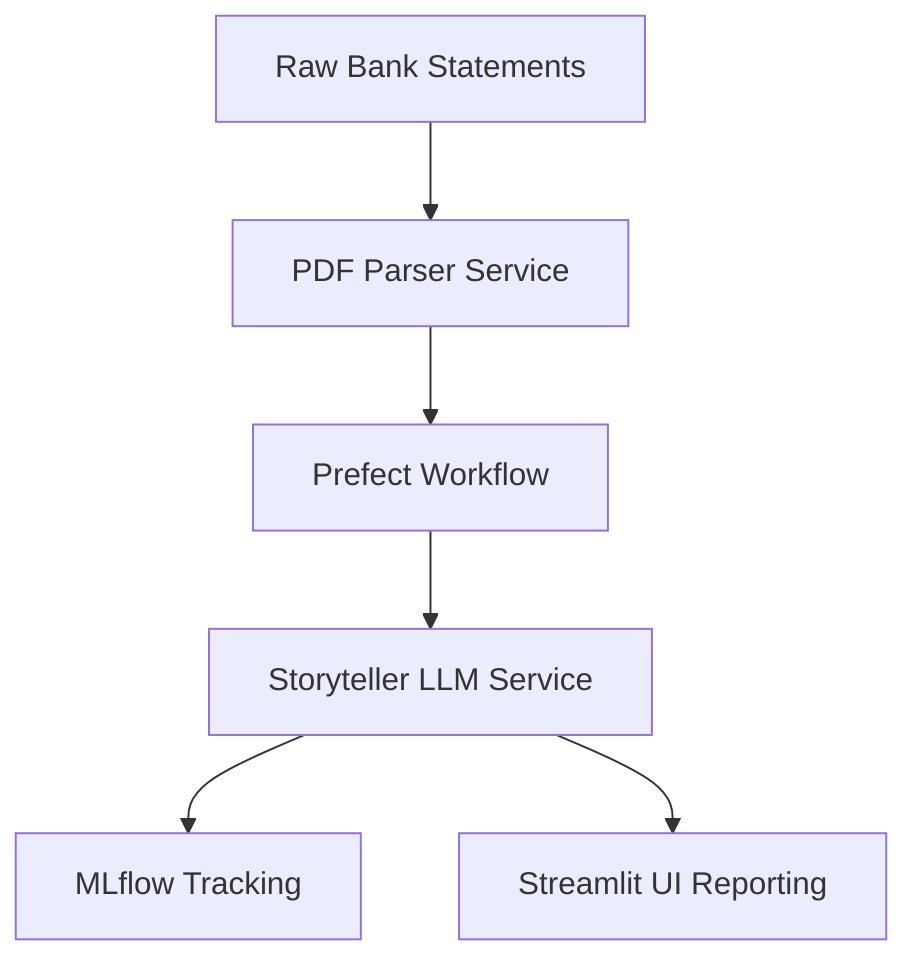

# Customer Financial Health Analyzer


An enterprise-grade financial document processing and analysis system. This platform automates the extraction of complex transactional data from unstructured PDF bank statements and utilizes sophisticated NLP modeling to generate "storyteller" narratives regarding a customer's holistic financial health, creditworthiness, and behavioral spending patterns.

## Table of Contents
- [Tech Stack & Architecture](#tech-stack--architecture)
- [Prerequisites](#prerequisites)
- [Installation & Local Setup](#installation--local-setup)
- [Usage & Running the App](#usage--running-the-app)
- [Testing](#testing)
- [Deployment](#deployment)
- [Contributing Guidelines](#contributing-guidelines)
- [License and Contact](#license-and-contact)

## Tech Stack & Architecture

### Core Technologies
- **PDF Intelligence**: `Camelot`, `Tabula-py`, `pdfplumber` (Advanced tabular data extraction)
- **Workflow Engine**: `Prefect` (Orchestrates complex data pipelines and retries)
- **Experiment Tracking**: `MLflow` (Logs model parameters and narrative generations)
- **Serving Layer**: `BentoML` (Containerized model execution)
- **Language Models**: `Ollama` (Local LLM hosting)
- **Interface**: `Streamlit` (Interactive analysis reports)

### High-Level Architecture
The system utilizes a containerized microservice design:
- **`Dockerfile.pdf_parser`**: Dedicated environment for heavy Java/Python dependencies required for PDF tabular parsing.
- **`Dockerfile.storyteller`**: Optimized environment for LLM-based narrative generation and financial risk assessment.
- **`docker-compose.yml`**: Orchestrates the interaction between retrieval, processing, and visualization layers.



## Prerequisites
- **Python**: v3.12+
- **Docker & Docker Compose**: Mandatory for service orchestration.
- **Java (JRE/JDK)**: Required for `tabula-py` and `camelot`.
- **Ghostscript**: Required for advanced PDF image processing.

## Installation & Local Setup

```bash
git clone https://github.com/Purusharth1/Customer-Financial-Health-Analyzer.git
cd Customer-Financial-Health-Analyzer
uv sync
```

### Environment Variables
Configure your localized services in `.env`:
```bash
MLFLOW_TRACKING_URI="http://localhost:5000"
PREFECT_API_URL="http://127.0.0.1:4200/api"
OLLAMA_HOST="http://localhost:11434"
```

## Usage & Running the App

### Starting the Orchestrated Stack
We recommend running through Docker for consistent dependency resolution:
```bash
docker-compose up --build
```
This initializes the PDF parser, the narrative LLM service, and the visualization UI.

### Manual Local Run
Alternatively, utilize the `JustFile` runners:
```bash
# Start Prefect server
prefect server start

# Run the analyzer app
uv run streamlit run ui/app.py
```

## Testing
- **Linter**: `uv run ruff check .`
- **Validation**: Manual validation scripts are found in `src/validate/` to ensure PDF extraction parity against ground-truth CSVs.

## Deployment
This project is designed for multi-container cloud deployment (e.g., AWS Fargate or Kubernetes). The separation of the "PDF Parser" and "Storyteller" services allows for independent scaling of compute resources based on document throughput volume.

## Contributing Guidelines
1. Adhere to **Strict PEP-8** standards.
2. Use **Conventional Commits**: `fix(parser): resolve coordinate shift in multi-page bank statements`.
3. All PRs must include an update to `project_docs/` if modifying core data schemas.

## License and Contact
- **License**: MIT
- **Contact**: Purusharth (https://github.com/Purusharth1)
