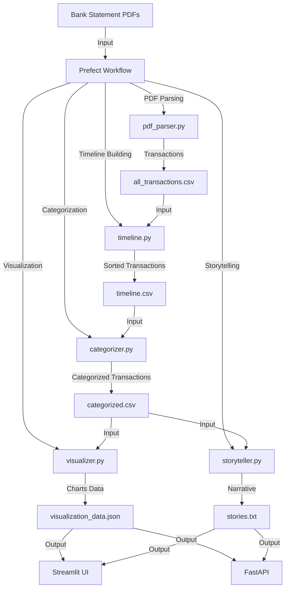

# Project Architecture

The **Customer Financial Health Analyzer** uses a modular architecture to process bank statements, analyze financial data, and deliver insights via a pipeline orchestrated by Prefect. Below is the system workflow.

## System Workflow

## Components
* **Bank Statement PDFs**: Input files containing transaction data.
* **Prefect Workflow**: Orchestrates tasks (workflows.py).
* **PDF Parser**: Extracts transactions and customer info using pdfplumber, tabula-py, and PyPDF2.
* **Timeline Builder**: Sorts transactions by date and adds parsed_date.
* **Categorizer**: Assigns categories (e.g., Shopping, Income) to transactions.
* **Visualizer**: Generates spending trends, expense breakdowns, and account overviews.
* **Storyteller**: Creates a financial narrative using Ollama LLM.
* **Outputs**: CSVs, JSON files, and text files stored in data/output/.
* **Streamlit UI**: Interactive dashboard for viewing transactions and insights.
* **FastAPI**: API for processing PDFs and retrieving results.

## Next Steps
* [Features](features.md)
* [Installation Guide](installation.md)